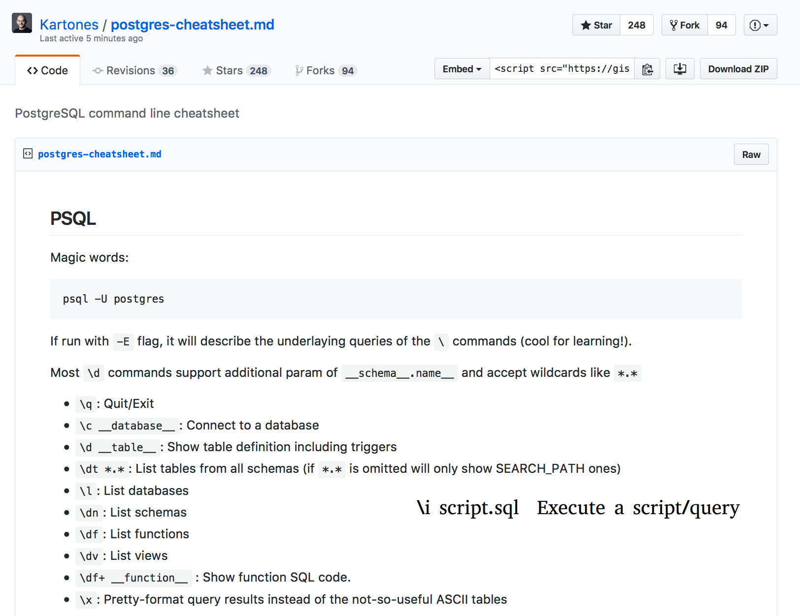

# SQL (Structured Query Language)

"An RDBMS (Relational Database Management System) is a database management system based on the relational model..., which in turn is based on two mathematical branches: set theory and predicate logic" - *T-SQL Fundamentals | Itzik Ben-Gan*

## Overview

[Entity-Relationship (ER) Diagram visualization tool](https://erdplus.com/#/)

ER diagrams allows one to visualize how a concept might map into a  RDBMS layout, or visualize an existing RDBMS layout.

**SQL is case and whitespace insensitive**

## Querying

Basic structure:

```SQL
SELECT ...
FROM ...
JOIN ...
ON ...
WHERE ...
GROUP BY ...
HAVING ...
ORDER BY ...;
```

Logical processing order of a SQL query:

```SQL
FROM ...
ON ...
WHERE ...
GROUP BY ...
HAVING ...
SELECT ...
DISTINCT ...
ORDER BY ...
TOP(LIMIT, OFFSET, FETCH, etc) ...
```

### Strings

To return rows that match a certain string/character sequence:

```SQL
WHERE <COLUMN> LIKE '%b'
# return all observations that end with a 'b' (can have any
# characters preceding the 'b')
```
```SQL
WHERE <COLUMN> LIKE 'b%'
# return all observations that start with a 'b' (can have any
# characters following the 'b')
```
```SQL
WHERE <COLUMN> LIKE '%b%'
# return all observations that contain a 'b' (can have any
# characters before or after the 'b')
```

### JOINS

* **LEFT (OUTER) JOIN** - Return all observations in the left table, along with the rows from the right table **that have a match in the left table.**

* **RIGHT (OUTER) JOIN** - Return all observations in the right table, along with the rows from the left table **that have a match in the right table.** (More commonly one will see a LEFT JOIN with the tables switched as opposed to a RIGHT JOIN)

* **INNER JOIN** -  Return observations where all information is present in both tables

* **FULL JOIN** - Return all observations from both tables, regardless of whether the information is present in the other table.

* **SELF JOIN** - When joining a table to itself, table aliases must be used along with the `JOIN` keyword.

    ```SQL
    SELECT alias_1.employee_id, alias_2.manager_id
    FROM table_1 alias_1
    JOIN table_2 alias_2
        ON alias_1.id = alias_2.id;
    ```
    Joining a table with itself is traditionally used when one wants to compare the values in one column to a value to another column **within the same table.**

## Database Management/Creation


## SSMS (SQL Server Management Studio)

* Using a `TOP` clause (synonymous to `LIMIT` in PostgreSQL) allows you to not overload the system
* use `NOLOCK`
  * Ensures your queries have as little impact on other processes as possible.
  * The risk of running your query with `NOLOCK` is that you might get "dirty/phantom" reads (observations that are not yet *committed* to the database, but is in an indeterminate state of being inserted, updated or deleted)
  * Should be used primarily for ad-hoc queries, but not in development (NEVER use when updating or deleting observations from a table).
* Check the estimated query plan before executing your query
* Knowing the indexes a table has can be helpful in determining what columns to efficiently filter and sort on
* `ORDER BY` clauses restrict the performance of queries

### Query (Execution) Plans

* Highlight a query and press CTRL + L (Windows) to view the execution plan.


## Resources

[PostgreSQL Practice](https://pgexercises.com/)


